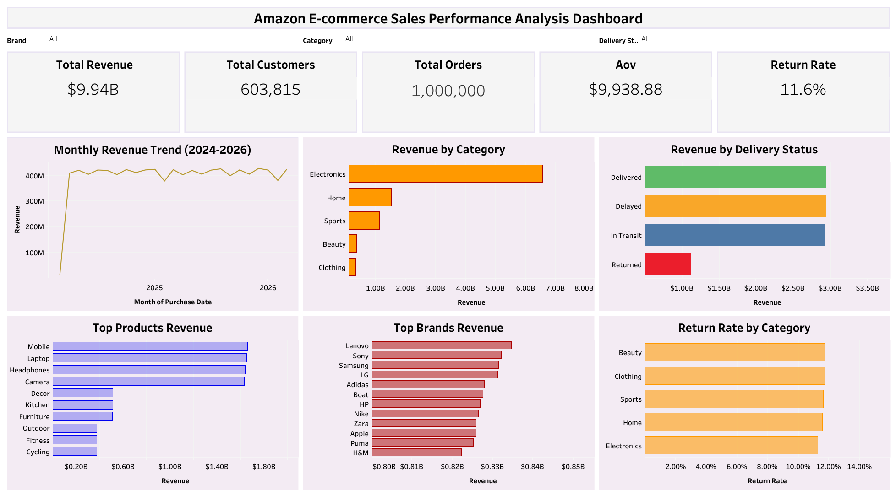
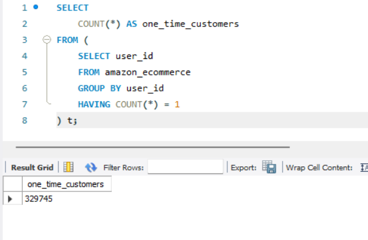
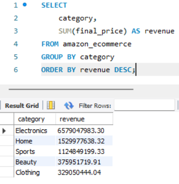
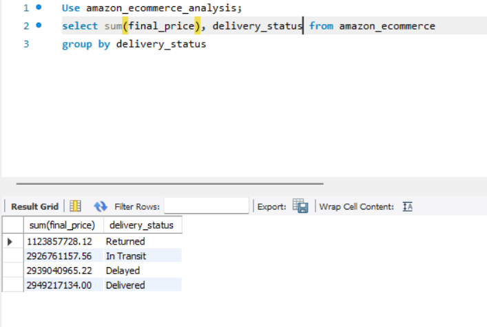
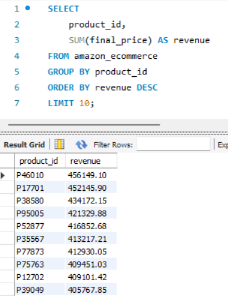
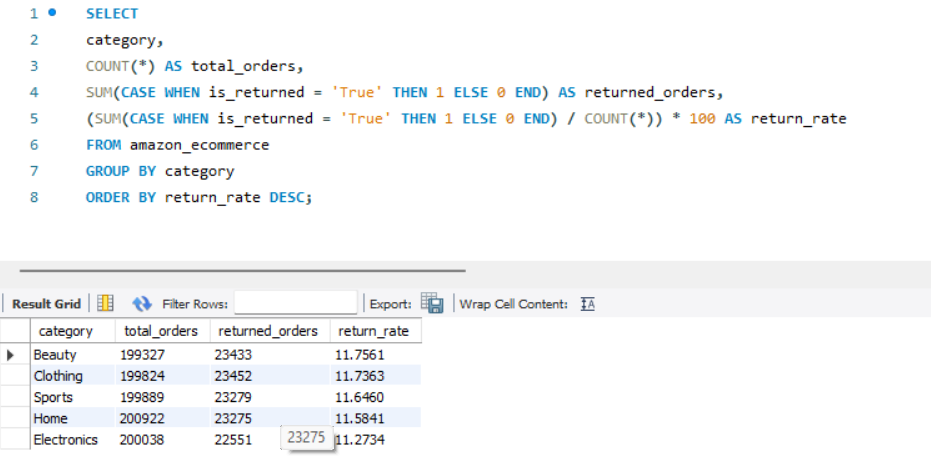
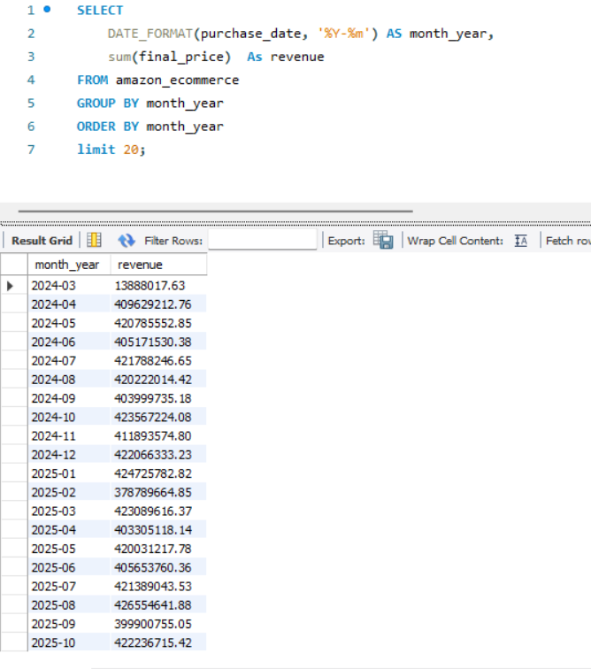
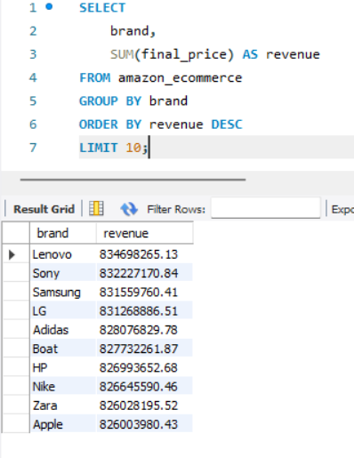

 🛒 Amazon E-Commerce Sales Performance Analysis

 📌 Project Overview

 In this project, I analyzed 1 million Amazon e-commerce transactions using SQL and transformed the findings into an       
 interactive Tableau dashboard. The objective was to uncover revenue trends, customer behavior, product performance,     
 delivery outcomes, and return patterns to support data-driven business decisions.

 This project simulates a real-world data analyst workflow by combining data exploration, business analysis, and  
 dashboard development to convert raw data into actionable insights.

 ---

 🚀 Project Highlights

 • Analyzed 1 million Amazon e-commerce transactions using SQL.
 • Built an interactive Tableau dashboard with 5 KPIs and 6 analytical visualizations.
 • Identified Electronics as the highest revenue-generating category ($6.58B).
 • Evaluated customer behavior, delivery performance, and return trends.
 • Generated actionable business recommendations from data-driven insights. 

 🎯 Business Objective

 The goal of this analysis was to answer key business questions:

 • Which product categories generate the highest revenue?
 • Which products and brands contribute most to sales?
 • How do delivery outcomes impact revenue?
 • What is the return rate across categories?
 • How stable is revenue performance over time?
 • Which areas offer opportunities for operational improvement?

 ---

 📂 Dataset Overview

 • Records: 1,000,000
 • Customers: 603,815
 • Categories: 9
 • Analysis Tool: MySQL
 • Visualization Tool: Tableau Public
 
 ---
 
 🛠️ Tools & Technologies

 • SQL (MySQL Workbench) – Data extraction, cleaning, and analysis
 • Tableau Public – Interactive dashboard development
 • Excel/CSV – Dataset management
 • GitHub – Project documentation and version control 

 ---

 📊 Key Performance Indicators (KPIs)

 | KPI                       | Value     |
 | ------------------------- | --------- |
 | Total Revenue             | $9.94B    |
 | Total Customers           | 603,815   |
 | Total Orders              | 1,000,000 |
 | Average Order Value (AOV) | $9,938.88 |
 | Return Rate               | 11.6%     |

 ---

 🎛️ Dashboard Features

 • Interactive filters for Brand, Category, and Delivery Status
 • Revenue trend analysis over time
 • Product and brand performance tracking
 • Delivery status monitoring
 • Return rate evaluation
 • Executive KPI overview

 ---
 
 📈 Key Business Insights

 👥 Customer Insights

 • 54.6% of customers made only one purchase.
 • 45.4% of customers were repeat buyers.
 • Customer retention presents a significant growth opportunity.

 💰 Revenue Performance

 • Electronics emerged as the highest revenue-generating category, producing $6.58B in sales.
 • Revenue remained consistently strong throughout the year, averaging approximately $400M–$425M per month.
 • Delivered orders generated the highest revenue contribution, highlighting strong order fulfillment performance.

 📦 Product Performance

 • Mobile, Laptop, Headphones, and Camera products generated the highest revenue among all product groups.
 • High-value electronic products dominated overall sales and played a major role in total business revenue.
 • Mobile products produced the highest overall revenue contribution.

 🏷️ Brand Performance

 • Lenovo, Sony, Samsung, LG, and Adidas ranked among the top revenue-generating brands.
 • Revenue distribution across leading brands remained highly competitive, indicating a balanced marketplace.

 🔄 Returns Analysis

 • Return rates remained relatively consistent across all categories, averaging between 11% and 12%.
 • Beauty products recorded the highest return rate, while Electronics recorded the lowest.
 • Returned orders represented a significant revenue impact, emphasizing the importance of return management  
   strategies.

 🚚 Delivery Performance

 • Delivered orders generated approximately $2.95B in revenue.
 • Delayed and In-Transit orders accounted for a substantial share of revenue, highlighting opportunities to improve 
   logistics performance.
 • Revenue tied to delayed shipments indicates potential customer experience and operational risks.

 ---

 📷 Dashboard Preview

 
 
 ---
 
 📊 Interactive Tableau Dashboard

 Explore the live dashboard:

 Tableau Public Dashboard:

 https://public.tableau.com/views/AmazonE-commerceSalesPerformanceAnalysis/AmazonE-  
 commerceSalesPerformanceAnalysisDashboard?:language=en- 
 US&:sid=&:redirect=auth&:display_count=n&:origin=viz_share_link

 ---

 📝 SQL Analysis & Query Results

 The following SQL queries were developed to investigate customer behavior, revenue drivers, delivery performance,  
 product trends, and return patterns across 1 million Amazon e-commerce transactions. The analysis was performed  
 using MySQL Workbench on a dataset containing 1 million Amazon e-commerce transactions.  
 Multiple SQL queries were written to evaluate customer behavior, revenue performance, product trends, brand  
 performance, delivery outcomes, and return rates.
 
 1. One-Time vs Repeat Customers

 

 Insight: More than 50% of customers made only one purchase, highlighting an opportunity to improve customer   
 retention.

 ---  
 
 2. Revenue by Product Category

 

 Insight: Electronics generated the highest revenue and emerged as the strongest-performing category.

 ---
 
 3. Revenue by Delivery Status

 

 Insight: Delivered orders contributed the largest share of total revenue. 

 --- 

 4. Top 10 Products by Revenue

 

 Insight: Mobile, Laptop, Headphones, and Camera products dominated revenue generation.

 ---
 
 5. Return Rate by Category

 

 Insight: Return rates remained relatively stable across categories, averaging around 11–12%.

 ---

 6. Monthly Revenue Trend

 

 Insight: Monthly revenue remained consistently strong between approximately $400M and $425M throughout the analysis  
 period, indicating stable sales performance and sustained customer demand. No significant revenue declines were  
 observed, suggesting a healthy and resilient business model.
 
 ---
 
 7. Top Brands by Revenue

 

 Insight: Lenovo, Sony, Samsung, LG, and Adidas emerged as the highest revenue-generating brands.

 ---
 
 🗂️ Project Structure

 ```text
 Amazon-Ecommerce-SQL-Analysis/
 │
 ├── README.md
 │
 ├── sql_queries/
 │   ├── customer_analysis.sql
 │   ├── revenue_analysis.sql
 │   ├── product_analysis.sql
 │   ├── brand_analysis.sql
 │   ├── delivery_analysis.sql
 │   └── return_analysis.sql
 │
 ├── screenshots/
 │   ├── dashboard-overview.png
 │   ├── one-time-vs-repeat-customers.png
 │   ├── revenue-by-category.png
 │   ├── revenue-by-delivery-status.png
 │   ├── monthly-revenue-trend.png
 │   ├── top-products-revenue.png
 │   ├── return-rate-by-category.png
 │   └── top-brands-revenue.png
 │
 └── dashboard/
    └── tableau-dashboard-link.txt
 ```
 

 ---

 💻 Sample SQL Analysis

 Example business question:

 • Which product categories generate the highest revenue?

 ```sql
 SELECT
    category,
    ROUND(SUM(final_price), 2) AS revenue
 FROM amazon_ecommerce
 GROUP BY category
 ORDER BY revenue DESC;
 ```

 ---

 🚀 How to Run This Project

 1. Clone the Repository

 ```bash
 git clone <repository-url>
 ```

 2. Import Dataset

 • Open MySQL Workbench
 • Create a database
 • Import the Amazon e-commerce dataset

 3. Execute SQL Queries

 • Run the SQL scripts located inside the:

 ```text
 sql_queries/
 ```

 folder.

 4. Explore the Dashboard

 • Open the Tableau Public dashboard using the link provided above.

 ---

 📌 Business Recommendations

 Based on the analysis:

 • Increase marketing investment in Electronics due to its strong revenue contribution.
 • Implement retention campaigns to encourage repeat purchases.
 • Monitor high-return product categories and identify root causes.
 • Improve logistics performance to reduce delayed shipments.
 • Focus inventory planning on top-performing product groups such as Mobile, Laptop, and Headphones.

---

 🎓 Skills Demonstrated

 • SQL Querying
 • Data Cleaning & Exploration
 • Business Analysis
 • KPI Development
 • Revenue Analysis
 • Customer Analytics
 • Product Performance Analysis
 • Return Rate Analysis
 • Data Visualization
 • Dashboard Design
 • Business Storytelling

 ---

 📬 Connect With Me

 If you would like to discuss data analytics, business intelligence, SQL, or dashboard development, feel free to  
 connect with me through GitHub and LinkedIn.

 ---

 ⭐ If you found this project interesting, consider giving the repository a star.
